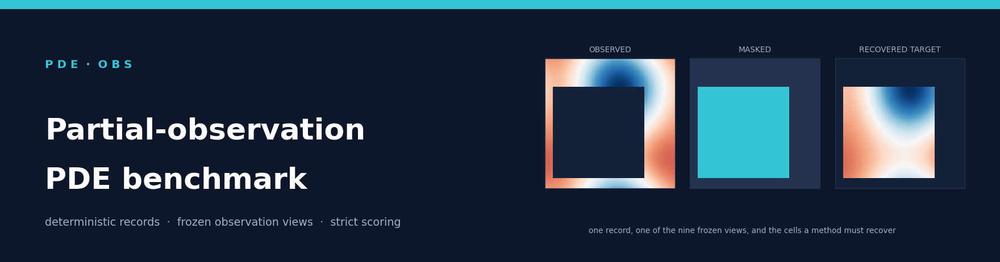
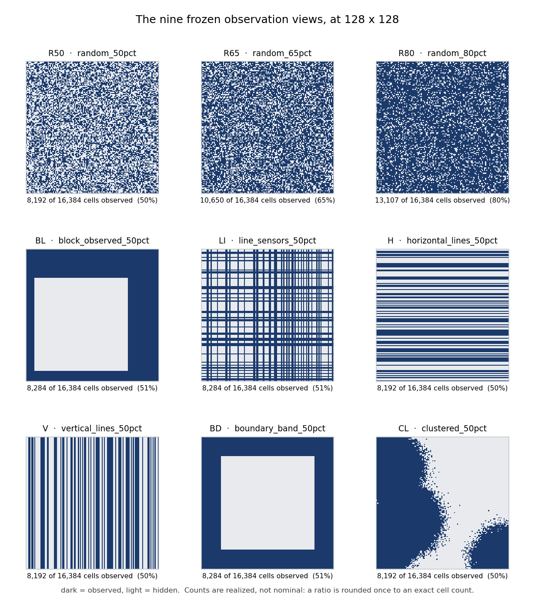
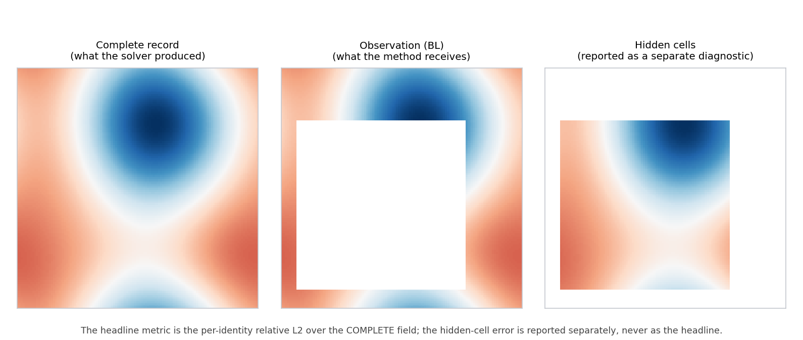

# PDE-OBS: Controlled Evaluation Across Observation Patterns

**Public research release.**
[Project page](https://ru1ch3n.github.io/PartialObs--PDEBench/) ·
[Paper PDF](paper/PDE_OBS_preprint.pdf) ·
[Data](https://huggingface.co/datasets/PDE-OBS/pdeobs-data) ·
[Models](https://huggingface.co/PDE-OBS/pdeobs-models)

Ruichen Xu\*, Siyao Wang, Fang Wan, Jiacheng Qiu, Wenhan Gao, Jiaxing Zhang,
Linsey Pang, Ravid Shwartz-Ziv, Yann LeCun, and Yuefan Deng\*.
\*Corresponding authors. See the paper for affiliations.

The current paper reports 441 retained checkpoints and 3,969 complete evaluation
blocks, each containing 200 held-out records; the separate mixed-pattern study
contains five completed models. The main grid is in
[`results/prediction_verification_20260924/`](results/prediction_verification_20260924/)
and the strict mixed-pattern comparisons, bootstrap intervals and stationary
diagnostics are in [`results/revision_v2/`](results/revision_v2/).
Historical results remain clearly separated. No new training or inference was
performed to prepare this public copy. This is a preprint, not an accepted
conference publication; an arXiv identifier has not yet been assigned.

```bash
git clone https://github.com/ru1ch3n/PDE-OBS.git
cd PDE-OBS
```

[](docs/installation.md)
[](LICENSE)
[](https://huggingface.co/datasets/PDE-OBS/pdeobs-data)
[](https://huggingface.co/datasets/PDE-OBS/pdeobs-data)
[](https://huggingface.co/PDE-OBS/pdeobs-models)
[](docs/benchmark_overview.md)
[](docs/scoring.md)
[](paper/PDE_OBS_preprint.pdf)

**Recover and forecast a complete physical field from a partial observation of that same field.**
A solver in this repository produces a complete numerical record, an observation operator hides
part of it, a task interface hands a method only what survives, and a strict scorer measures the
whole field. One physical record serves every observation pattern, so a change of pattern is the
only thing that changes between two evaluations.



> **Reviewers and audit tools:** start at [AI_START_HERE.md](AI_START_HERE.md). It indexes the two
> review overlays, the patch notes, the cost-levelled command list and the acceptance records.

---

## Why PDE-OBS

- **One control.** The observation operator applied to a physical record is varied while the record,
  its prediction target and the train/test split stay fixed. Every cross-view number in the grid is a
  like-for-like comparison on identical test records.
- **Nine frozen views, exact counts.** Random, block, line, band and clustered patterns at 128 x 128,
  replayed verbatim from one namespace with realized cell counts, never nominal ratios.
- **Strict scoring, no silent shrinkage.** Raw predictions are validated before any metric. A missing,
  repeated, extra or non-finite entry invalidates the score instead of quietly leaving the denominator.
- **Everything is generated here.** Seven PDE families, ten condition-field constructions, seeded
  identities, resumable shards. Nothing is downloaded or converted from another corpus, and the same
  specification reproduces the same record.
- **Hash-bound evidence.** The new prediction result cut covers all 441 retained checkpoints and
  3,969 full-200 blocks. Data/weight hashes were checked in the verification environment;
  current external anonymous download access remains a separate release check.

## What you get

| | Contents | Where |
|---|---|---|
| **Records** | Darcy, Poisson, Helmholtz (stationary); Heat, reaction-diffusion, Burgers, Navier-Stokes (temporal). 2,000 records per family x boundary x construction at 128 x 128, 15 stored frames for temporal families. | [Dataset card](docs/dataset_card.md) · [🤗 pdeobs-data](https://huggingface.co/datasets/PDE-OBS/pdeobs-data) |
| **Views** | R50, R65, R80, BL, LI, H, V, BD, CL: nine frozen observation patterns with exact observed-cell counts. | [Observation views](docs/observations.md) |
| **Tasks** | Recovery (stationary) and rollout (temporal) in the paper; forward and inverse interfaces also ship. | [Tasks and permissions](docs/tasks_and_permissions.md) |
| **Methods** | U-FNO, FNO, CNO, DeepONet, GNOT, Transolver, PINO as public learned baselines, plus classical interpolators and reduced-order comparators. | [Methods card](docs/methods_card.md) |
| **Checkpoints** | All 441 credited (PDE, method, training view) rows, weights only, with de-identified training records; `results/public_deposits/release_map.json` binds the published digests to the campaign's checkpoint identities. | [Public release](docs/public_release.md) · [🤗 pdeobs-models](https://huggingface.co/PDE-OBS/pdeobs-models) |
| **Results** | New prediction-checked scores for 441 checkpoints and 3,969 full-200 blocks, per-record errors and mean ± sample SD; historical scores retained separately. | [New results](results/prediction_verification_20260924/README.md) · [Verification](docs/prediction_verification.md) |
| **Scorer** | `pdeobs-strict-v1`: contract, identity set, shapes and time indices fixed in advance; float64 per-identity relative L2, arithmetic mean over the complete expected set. | [Scoring](docs/scoring.md) |

## Quick start

Python 3.10 or newer, into a clean environment. No download, no GPU and no configuration file are
needed for the first run.

```bash
python -m venv .venv            # then activate it for your shell
python -m pip install ".[train]"   # ".[train]" adds PyTorch; "." alone gives the generators, views and scorer
pdeobs --help

# one small CPU demo: generate, mask, recover, strict-score, write a receipt
pdeobs demo --example E2 --data-root ./demo-data --output-root ./demo-runs --threads 1

# one real case, generated locally
pdeobs generate-case --pde poisson --boundary periodic --setting smooth_grf \
    --param-regime low --num-samples 4 --resolution 16 --seed 17 --root ./my-data
```

Three constraints cause almost every first-run failure, so read them once:

- **SciPy `>=1.12` is load-bearing.** Both elliptic iterative routes call `scipy.sparse.linalg.cg`
  / `minres` with the `rtol` keyword; an unsupported signature is not switched silently, and
  non-convergence raises rather than returning a partial solve.
- **Demos and the core test runner need fresh, non-nested directories.** `pdeobs demo` creates
  `<data-root>/E<n>` and `<output-root>/E<n>` with `exist_ok=False`, so re-running an example into a
  root that already holds it fails rather than overwriting an earlier receipt.
- **A version-control binary must be on `PATH`.** One test builds a synthetic local repository to
  check provenance collection. No account, scheduler or endpoint is required by the test scope.

The other five demos and what each proves, the extras (`train`, `paper`, `analysis`, `test`) and the
tested lower-bound environment are in [Install and first run](docs/installation.md); every command,
argument and exit code is in the [Command reference](docs/cli_reference.md).

## How to use PDE-OBS

Six workflows cover what most people come here to do. Every snippet below was executed against the
published artifacts before it was written down.

### 1. Get the records

Two checksum manifests are published beside the data. Both are the release-manifest v1 contract of
[`src/pdeobs/download.py`](src/pdeobs/download.py): one entry per file with its SHA-256, byte size
and URL, including the `.manifest.json`, `.sha256` and `.quality.json` sidecars that the loader's
verify mode checks against.

| Manifest | Contents | Size |
|---|---|---|
| `release_manifest.json` | the paper-evaluated slice: one boundary and the `smooth_grf` construction per family, 14,000 records, 84 shards | 6.5 GB |
| `release_manifest_full.json` | the complete factorial design: 7 families x 4 boundaries x 10 constructions = 280 macrodomains, 560,000 records, 3,360 shards | 244 GB |

```bash
# the evaluated slice (what the paper's grid was trained and scored on)
pdeobs download --tier full --output ./pdeobs-data \
    --manifest https://huggingface.co/datasets/PDE-OBS/pdeobs-data/resolve/main/release_manifest.json

# the complete corpus
pdeobs download --tier full --output ./pdeobs-full \
    --manifest https://huggingface.co/datasets/PDE-OBS/pdeobs-data/resolve/main/release_manifest_full.json
```

The downloader validates the manifest's schema, status, tiers and digests before it fetches anything,
resumes interrupted files, and verifies every file's SHA-256 on arrival. It has **no default
endpoint**: omitting `--manifest` fails before any network request. Local regeneration remains the
route that produces *new* records ([Dataset card](docs/dataset_card.md)).

### 2. Build a task instance

```python
from pdeobs import api

data = api.load_dataset("./pdeobs-data", verify=True)      # checks every shard against its sidecars
obs = api.make_observation("paper:R50")                    # one of the nine frozen views
package, targets = api.inference_input_from_dataset(
    data, obs, task="recovery", max_samples=8)             # observation-only package; targets stay with you
```

`package` carries the masked field, the `float32` mask, the geometry and the identities, and nothing
else. `targets` is returned to the caller only so that a later `evaluate` can score; `predict` never
sees it. For a temporal family use `task="rollout"` with `history_steps=1` and pass `horizon=` to
`predict`.

### 3. Score a released checkpoint

```python
pred = api.load_legacy_checkpoint(
    "models/cluster-A/poisson/fno/random_50pct/checkpoints/last.pt",
    model={"name": "fno", "preset": "paper"}, task="recovery")   # structure is stated, never guessed
bundle = api.predict(pred, package)
score = api.evaluate(bundle, targets)

score["status"]                          # "valid" or the reason the score is void
score["scoring_version"]                 # "pdeobs-strict-v1"
score["summary"]["rel_l2_joint_mean"]    # float64 per-identity relative L2, then arithmetic mean
score["per_identity"]                    # one entry per record, with observed/hidden diagnostics
```

The architecture of every published checkpoint is recorded in the `resolved.yaml` beside it
(`method.name`, `method.kwargs`); the campaign checkpoints use the `paper` preset of their method.
The loader cross-checks the checkpoint's own stored training configuration for task and physics
contract, and its provenance records the checkpoint's SHA-256 and epoch.

### 4. Evaluate your own method

Register a class with `register_method` and implement `predict(observations, mask=None, **kwargs)`.
Unobserved entries arrive filled with `0.0`, which is why the mask is supplied separately: a physical
zero must not be read as a missing value.

```python
import numpy as np
from pdeobs.methods.base import MethodCapabilities, register_method
from pdeobs.methods import create_method

@register_method("my_method")
class MyMethod:
    name = "my_method"
    capabilities = MethodCapabilities(tasks=frozenset({"recovery"}), trainable=False, requires_mask=True)

    def predict(self, observations, mask=None, **kwargs):
        return np.where(np.asarray(mask, dtype=bool), observations, 0.0)   # your model goes here

method = create_method("my_method")
preds = np.stack([method.predict(package.observations[i], package.mask[i])
                  for i in range(len(package.sample_ids))])
bundle = api.PredictionBundle(predictions=preds.astype(np.float32), sample_ids=list(package.sample_ids),
                              time_indices=list(package.time_indices), task="recovery", inputs=package,
                              provenance={"observation": package.metadata["observation"]})
score = api.evaluate(bundle, targets)          # status "valid", observation_id "paper:random_50pct:..."
```

The same `evaluate` call scores a shipped baseline (`api.create_model("nearest", task="recovery")`
wrapped in `api.Predictor`), a released checkpoint and your method, so the three are directly
comparable on the same identities under the same view. The full method contract,
including what a method may and may not receive per task, is in
[Extending PDE-OBS](docs/extending.md#how-do-i-add-a-new-method).

### 5. Train under the frozen protocol

`api.train` trains any registered model on a dataset handle under one observation pattern, with a
declared budget and split, and writes an artifact that `load_predictor` restores:

```python
run = api.train(data, task="recovery", model={"name": "fno", "preset": "paper"},
                observation=api.make_observation("paper:R50"),
                split="holdout:0.25", budget={"epochs": 5}, out="runs/fno-r50")
predictor = api.load_predictor(run.artifact.path)
```

`split="holdout:<fraction>"` excludes the held-out identities from training and records them in the
run's split receipt. The paper's own protocol, one `pdeobs paper-row` invocation per grid cell with
the nine strict evaluations it runs afterwards, is in
[Reproduce one grid cell](#reproduce-one-grid-cell) and
[Reproducing the paper](docs/reproducing_the_paper.md).

### 6. Report a result

A PDE-OBS number is five things together: long-format rows (one per scored cell, never a
pre-aggregated table), the resolved configuration, the strict contract and its SHA-256, the scorer
version, and the run bundle. `pdeobs strict-infer` writes a versioned bundle that
`pdeobs strict-score` re-scores directly:

```bash
pdeobs strict-infer --config ./row.yaml --contract ./contract.json --data-root ./pdeobs-data \
    --manifest ./identities.json --checkpoint ./last.pt --output ./strict-run
pdeobs strict-score --predictions ./strict-run/predictions.h5 --contract ./strict-run/contract.json \
    --output ./strict-run/score.json
```

A table must say which training cohorts and scoring versions it pools. The exact submission format
is in [Contributing a result](docs/extending.md#contributing-a-result).

## The grid


**7 PDE families x 7 public learned methods x 9 frozen views = 441 training rows**, and each of the
441 checkpoints is evaluated on all nine test views, so **441 x 9 = 3,969 cross-view evaluation
blocks**. The word *public* is load-bearing: the campaign configuration declares an eighth learned
slot and therefore counts 504 rows; that slot is withheld from this release.

The new prediction evaluation is complete: all 441 retained checkpoints and all
3,969 blocks contain 200 finite prediction/target records, with verified identities,
masks, physical-time mappings and hash bindings. The new scores, per-record errors
and CPU aggregation scripts are in
[`results/prediction_verification_20260924/`](results/prediction_verification_20260924/README.md).
No model was retrained or selected from its new test score. Raw tensors are not
embedded in Git. Historical scalar scores remain unchanged in
[`results/archived_campaign/`](results/archived_campaign/README.md), but are not the
current result source. These checks establish file validity, not model quality,
uniform training budgets, numerical-reference accuracy or external anonymous access.

## The nine views



Counts are realized, not nominal: a ratio is rounded once to an exact cell count, and the same mask
is replayed for every method. The four namespaces that resolve an observation request, and why asking
for a paper view name from the `general` namespace is a hard error rather than a silent fallback, are
in [Observation views](docs/observations.md).

**Beyond the nine views (v0.2.1).** Anywhere a protocol name is accepted, a *spec* is accepted
too: a protocol with an observed percentage (`uniform 1`, `block 50`, `boundary 50`) or a `+`-joined
mixture such as `uniform 1 x2 + sensor 20 + block 50`, for training and for test views alike. Together
with `data.mask_seed` and `training.seed` this gives the matched-budget mixed-pattern baseline and the
controlled multi-seed subset without touching the nine frozen views. See
[Observation specs](docs/observation_specs.md).



*Left: a complete record. Middle: the same record under the `BL` view, which is what a method
receives. Right: the cells it never sees. The headline metric is the per-identity relative L2 over
the complete field; the hidden-cell error is reported beside it, never in its place. Regenerate every
figure with `python docs/figures/make_figures.py`.*

## Results snapshot

Only the new prediction result version `pdeobs-prediction-verification/20260925-v1`
is used below. Entries are mean ± sample SD (ddof=1) of 63 matched or 504
cross-pattern **cell means** per PDE, across seven methods. Median C/D uses
seven pairwise ratios. These are relative-L2 errors, not error percentages or
seed uncertainty; heterogeneous training histories preclude an architecture ranking.

| PDE | Matched error | Cross-pattern error | Median C/D |
|---|---:|---:|---:|
| Darcy | 0.08 ± 0.10 | 0.80 ± 2.40 | 13.45 |
| Poisson | 0.06 ± 0.07 | 1.50 ± 5.71 | 16.58 |
| Helmholtz | 0.05 ± 0.14 | 4.91 ± 30.45 | 28.61 |
| Heat | 0.09 ± 0.07 | 1.16 ± 6.77 | 3.62 |
| Reaction-diffusion | 0.11 ± 0.12 | 1.19 ± 5.60 | 3.36 |
| Burgers | 0.10 ± 0.11 | 0.51 ± 1.65 | 3.63 |
| Navier-Stokes | 0.04 ± 0.04 | 0.34 ± 0.50 | 7.39 |

The full cut retains all 49 complete 9 × 9 matrices. Individual cells report
mean ± SD over 200 records; pair-level D/C SDs instead describe 9/72 cell means.
The unchanged complete-configuration-matched original500 subset contains
117 models (13 pairs), not all checkpoints that happen to have 500 epochs.
All adverse finite results are retained; no bold winner is assigned across
unmatched methods. See [the full cut](results/prediction_verification_20260924/README.md)
and [training provenance](docs/training_template_and_records.md).

## Reproduce one grid cell

One cell is one `pdeobs paper-row` invocation plus the nine strict evaluations it runs afterwards.
Copy [`configs/paper/row_original500.yaml`](configs/paper/row_original500.yaml), set the axis values
and fix the copy's two relative paths:

```yaml
cohort: original500       # only original500 and demo are executable here
pde: poisson              # darcy | poisson | helmholtz -> recovery; heat |
                          #   reaction_diffusion | burgers | navier_stokes -> rollout
method: fno               # ufno_2d | fno | cno | deeponet | gnot | transolver | pino
train_view: random_50pct  # random_50pct R50 | random_65pct R65 | random_80pct R80 |
                          #   block_observed_50pct BL | line_sensors_50pct LI |
                          #   horizontal_lines_50pct H | vertical_lines_50pct V |
                          #   boundary_band_50pct BD | clustered_50pct CL
training_seed: 20260804   # seeds model initialization and training only
```

```bash
# 1. pin the identities you hold: hashes existing shards, generates nothing
pdeobs identity-manifest --data-root ./pdeobs-data \
    --shards poisson/dirichlet/smooth_grf/low/shard_00000.h5 \
    --output ./poisson-identities.json

# 2. train the row, then strict-score all nine test views (a full training command, not a smoke test)
pdeobs paper-row --config ./my-row.yaml \
    --data-root ./pdeobs-data --manifest ./poisson-identities.json \
    --output ./paper-runs/poisson-fno-r50-attempt-1 --device cpu
```

The protocol guard in one sentence: the data must already exist and match the manifest before any
training run, training completes before any test array is touched, the final checkpoint is reloaded
into a fresh model (test identities are never used for checkpoint selection), and inference runs from
the observation package alone. Changing `training_seed` re-seeds the weights and nothing else; the
identity split and the mask pairing come from the campaign file's `seed`. The split, the cohorts and
the full run bundle are in [Reproducing the paper](docs/reproducing_the_paper.md).

## Documentation

| Start here | Question it answers |
|---|---|
| [Benchmark overview](docs/benchmark_overview.md) | What is the grid, how does 441 decompose, and what do the two accountings mean? |
| [Install and first run](docs/installation.md) | How do I install it, and what do the six demos prove and not prove? |
| [Command reference](docs/cli_reference.md) | What is every CLI command, argument and exit code? |
| [Repository map](docs/repository_map.md) | What is in each directory, and which pointers here are stale? |
| **The benchmark** | |
| [Dataset card](docs/dataset_card.md) | What are the records, how is each family generated, and how do I obtain them? |
| [Public release](docs/public_release.md) | Where are the published records and trained checkpoints, and how do I verify them? |
| [Observation views](docs/observations.md) | What are the nine frozen views and the four namespaces that resolve them? |
| [Observation specs](docs/observation_specs.md) | How do I request a protocol with a parameter, train on a mixture of patterns, test on another, or run a controlled multi-seed subset? (v0.2.1) |
| [Methods card](docs/methods_card.md) | Which methods ship, with what parameters, and what is claimed about each adaptation? |
| [Tasks and permissions](docs/tasks_and_permissions.md) | What may a task interface see, and what is forbidden? |
| **Running and scoring** | |
| [Reproducing the paper](docs/reproducing_the_paper.md) | What is the protocol, and how do I execute one row? |
| [Scoring](docs/scoring.md) | What does the strict scorer check, and what invalidates a score? |
| [Results format](docs/results_format.md) · [Archived results](docs/archived_results.md) | What shape does a result take, and what do the archived numbers establish? |
| **Reference** | |
| [Numerical solvers](docs/numerical_solvers.md) · [Data schema](docs/data_schema.md) · [Inference schema](docs/data_and_inference_schema.md) | How are records computed and stored? |
| [Model parameters](docs/model_parameter_reference.md) · [Observation reference](docs/observation_reference.md) · [Checkpoint compatibility](docs/checkpoint_compatibility.md) | Generated reference tables |
| [Extending PDE-OBS](docs/extending.md) | How do I add a PDE, a method or an observation view? |
| [Claims and limits](docs/claims_and_limits.md) | What does this release assert, and what does it explicitly not? |
| [Testing checklist](docs/testing_checklist.md) | Which tests must pass, and what is out of scope? |

## Repository layout

```text
src/pdeobs/    the library: generators, storage, masks, methods, training,
               the strict scorer, the CLI, and the `pdeobs.api` layer
configs/       one subdirectory per run axis: paper protocol, campaign, methods,
               dataset tiers, demos, extensions, analysis, and the preserved
               historical `experiment/` set
docs/          reference documentation, indexed by the question each file answers
results/       current prediction-level cut plus the preserved historical archive
tests/         the test suite; tests/test_benchmark_essentials.py is the
               minimal must-have set
release/       candidate metadata, the frozen CPU test scope, the validation
               record, and the core test runner
acceptance/    two software sweeps of the v0.2.0 interface layer, never a paper table
examples/      one portable script that forwards to the demo entry point
```

[Repository map](docs/repository_map.md) walks every directory, indexes all of `docs/`, and lists
the pointers in this tree that are known to be stale.

## Extend

- [Add an observation view](docs/extending.md#how-do-i-add-a-new-observation-view): a mask factory plus its registration.
- [Add a method](docs/extending.md#how-do-i-add-a-new-method): the shape and information contracts a predictor must honor.
- [Add a PDE or condition generator](docs/extending.md#how-do-i-add-a-new-pde-or-condition-generator): a solver, its settings and its provenance.
- [Add a metric](docs/extending.md#how-do-i-add-a-new-metric), or [bring your own arrays](docs/extending.md#custom-physical-arrays-without-writing-a-solver) without writing a solver.

Registration does not certify a plugin: a registered component has been imported, not validated.
The `configs/` subdirectories are the legal values of each run axis; several of them are descriptive
schemas rather than runnable jobs, as [`configs/paper/README.md`](configs/paper/README.md) states.

## Tests and evidence

```bash
python -m pip install ".[train,test]"
python -m pytest -q -p no:cacheprovider tests/test_benchmark_essentials.py

# the broader CPU-only portable scope; both directories must be new, outside the
# source tree, and distinct from each other
python release/run_core_tests.py --source-root . --output-dir ../pdeobs-core-results --basetemp ../pdeobs-core-temp
```

`tests/test_benchmark_essentials.py` calls `pytest.importorskip("torch")`, so on a `[test]`-only
install the model-coverage, reproducibility and provenance categories skip rather than run; the
521-collected / 521-passed / 0-skipped figure in [Testing checklist](docs/testing_checklist.md) is
not reachable from that environment. The release distinguishes four evidence levels, **implemented**,
**smoke-tested**, **reference-checked** and **paper-evaluated**, and keeps four things apart that are
easy to confuse: the code paths that exist, what was executed on this copy with logs
([`docs/ai/evidence_status.json`](docs/ai/evidence_status.json),
[`docs/ai/ACCEPTANCE_INDEX.md`](docs/ai/ACCEPTANCE_INDEX.md)), the chain a paper cell must satisfy
([`docs/paper_evidence.md`](docs/paper_evidence.md)), and the author-required materials. The
consolidated list of what is **not done** is in [Claims and limits](docs/claims_and_limits.md).

## Claims, licences and anonymity

**Claims.** The original archive retains legacy scoring provenance and no old
prediction tensors are recovered retroactively. A separate inference-only
verification checks all 441 retained checkpoints and 3,969 full-200 blocks with
the frozen strict scorer and publishes new per-record and aggregate scores.
There are zero invalid blocks and zero failed models in this verification.
3,646 blocks meet the old strict comparison threshold, 314 additional blocks
differ by at most 1%, and nine by more than 1%. The 1% summary is post hoc and
does not determine validity or score selection. Specific numerical causes of
differences are unconfirmed. A complete evaluation is not a quality PASS,
controlled architecture ranking or numerical convergence study. Software smoke
scores are never paper evidence.

**Licences.** Code, data and weights are licensed separately. [`LICENSE`](LICENSE) (MIT) covers the
code only. The dataset repository declares CC BY 4.0 on its card and the model repository declares
MIT on its card; neither is granted by this tree, which contains no production dataset, weights,
credentials or scheduler state. Third-party notices and required attribution are in
[`THIRD_PARTY_NOTICES.md`](THIRD_PARTY_NOTICES.md); an adapted implementation names its upstream
anchor, the revision inspected and that revision's licence at the point of adaptation.

**Anonymity.** New result files are checked for private paths, account strings and
credential-like markers before publication. Original/released checkpoint digest
mappings are retained in `results/public_deposits/release_map.json` without raw tensors or
private transport receipts; the public deposits list published digests only, and their
histories were squashed to one commit each on 26 September.
This does not certify external dataset/model cards, histories or permissions.
Anonymous accessibility must be checked independently; the deposits were re-published
from de-identified copies on 26 September and reached without credentials on that date
(`tools/revision/check_access.py`, `results/revision_v2/access_check.json`).
Required third-party paper, repository and licence attribution remains.
Provenance generated on a real machine can contain host/interpreter/scheduler
metadata and must be reviewed before sharing.

## Citation

Anonymous submission under double-blind review. A citation block will replace this section in the
camera-ready version.
