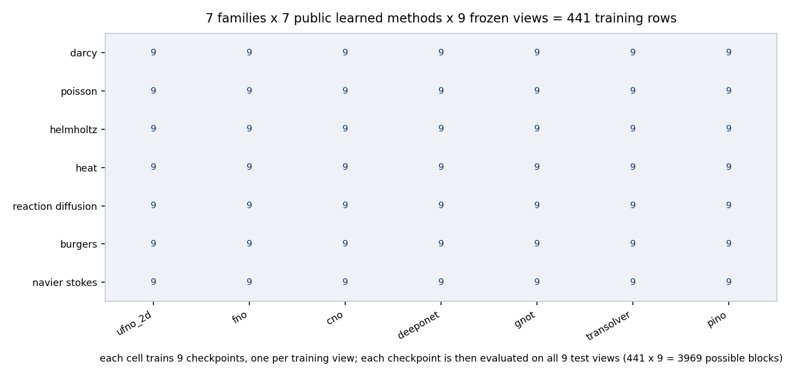

# PDE-OBS at a glance: what the benchmark is and how its grid is counted

PDE-OBS is a benchmark for recovering and forecasting a complete physical field
from a partial observation of that same field. It is built from four things kept
deliberately apart: a **complete numerical record** produced by a deterministic
PDE generator, an **observation operator** that turns that record into a boolean
mask plus filled values without ever re-invoking the solver, a **task interface**
that hands a method only the observation package, and a **strict scorer** that
splits observed from unobserved cells and refuses a malformed artifact instead of
quietly shrinking its denominator.

The headline quantity the benchmark reports is the **full-field per-identity
relative L2**, in float64, averaged over the complete expected held-out identity
set (`reported_mean = sum_i relative_l2_i / N_expected`, [Scoring](scoring.md)).
Error on cells the model never saw is reported too, but as a *separately named
diagnostic* (`hidden_only_rel_l2`, plus observed / hidden components that share
one full-target denominator) — it is not the headline number. The held-out
identity set is shared by every method and every observation view of the same
physical case.

## The grid as an arithmetic claim

*Every cell of the family-by-method table is trained nine times, once per training view, and each of
those checkpoints is then evaluated on all nine test views. Regenerate with
`python docs/figures/make_figures.py`.*

The paper protocol is a product, and the product is auditable:

**7 PDE families x 7 public learned methods x 9 frozen observation views = 441
planned training rows.** Each of those 441 checkpoints is then evaluated on all
nine test views, so **441 x 9 = 3969 possible learned cross-view blocks.**

Both numbers are declared machine-readably in
[`configs/paper/protocol.yaml`](../configs/paper/protocol.yaml)
(`training_rows: 441`, `test_views_per_checkpoint: 9`,
`possible_learned_blocks: 3969`).

In the same breath: **3969 is a denominator, not a completion count.** It states
how many cells the design has, not how many have been filled. The campaign that
fills the grid is still running, and this release contains no benchmark result
numbers of any kind. `RESULT_PENDING` is *declared* as the protocol's
missing-result marker (`configs/paper/protocol.yaml` ->
`scoring.missing_result_marker`), and the intent it encodes is that a missing
cell is never zero, never an interpolated curve and never another row's value.
It is a declaration, not active behaviour: **no module under `src/` emits or
reads `RESULT_PENDING`**, and no aggregator in this tree applies it — the
repository says so itself in [Claims and limits](claims_and_limits.md) and
[Results format](results_format.md). Until that marker is implemented, an absent
cell in this tree is simply absent.

The seven PDE families, in the frozen order the code validates
(`src/pdeobs/one_setting.py` -> `PDE_ORDER`):

`darcy`, `poisson`, `helmholtz`, `heat`, `reaction_diffusion`, `burgers`,
`navier_stokes`.

The seven public learned methods, in the frozen order
(`configs/paper/protocol.yaml` -> `learned_methods`;
`src/pdeobs/one_setting.py` -> `PUBLIC_LEARNED_METHODS`):

| Protocol id | Model-factory key | Implementation |
|---|---|---|
| `ufno_2d` | `ufno` | [`src/pdeobs/methods/neural.py`](../src/pdeobs/methods/neural.py) |
| `fno` | `fno` | [`src/pdeobs/methods/neural.py`](../src/pdeobs/methods/neural.py) |
| `cno` | `cno` | [`src/pdeobs/methods/neural.py`](../src/pdeobs/methods/neural.py) |
| `deeponet` | `deeponet` | [`src/pdeobs/methods/operator_networks.py`](../src/pdeobs/methods/operator_networks.py) |
| `gnot` | `gnot` | [`src/pdeobs/methods/operator_networks.py`](../src/pdeobs/methods/operator_networks.py) |
| `transolver` | `transolver` | [`src/pdeobs/methods/operator_networks.py`](../src/pdeobs/methods/operator_networks.py) |
| `pino` | `pino` | [`src/pdeobs/methods/neural.py`](../src/pdeobs/methods/neural.py) plus the residuals in [`src/pdeobs/pino.py`](../src/pdeobs/pino.py) |

Only one row needs a naming note, and it involves two different tables. `ufno_2d`
is the protocol identifier, and it is also the key used by the method registry
[`configs/method/all_pde_source_faithful_registry.yaml`](../configs/method/all_pde_source_faithful_registry.yaml)
(`implementation: src/pdeobs/methods/neural.py::UFNO2d`). The **model factory** in
[`src/pdeobs/methods/__init__.py`](../src/pdeobs/methods/__init__.py) keys the same
class as `ufno`, and `src/pdeobs/one_setting.py` carries the explicit
`ufno_2d -> ufno` mapping between the two. The rename adds no algorithm.

The nine frozen observation views, with their exact realized observed-cell counts
at 128 x 128 (16,384 cells). Source of truth:
[`configs/paper/observations.yaml`](../configs/paper/observations.yaml),
mirrored as `PAPER_VIEWS` in
[`src/pdeobs/api/specs.py`](../src/pdeobs/api/specs.py).

| Label | View | Mask protocol and parameters | Observed cells |
|---|---|---|---:|
| R50 | `random_50pct` | `random_3pct`, `ratio: 0.50` | 8192 |
| R65 | `random_65pct` | `random_3pct`, `ratio: 0.65` | 10650 |
| R80 | `random_80pct` | `random_3pct`, `ratio: 0.80` | 13107 |
| BL | `block_observed_50pct` | `block_missing`, `missing_fraction: 0.49` | 8284 |
| LI | `line_sensors_50pct` | `line_sensors`, `num_lines: 76`, `orientation: both` | 8284 |
| H | `horizontal_lines_50pct` | `line_sensors`, `num_lines: 64`, `orientation: horizontal` | 8192 |
| V | `vertical_lines_50pct` | `line_sensors`, `num_lines: 64`, `orientation: vertical` | 8192 |
| BD | `boundary_band_50pct` | `boundary_sensors`, `width: 19` | 8284 |
| CL | `clustered_50pct` | `clustered_sensors`, `ratio: 0.50` | 8192 |

These counts are asserted by the test suite — `tests/test_benchmark_essentials.py`
parametrizes over all nine `PAPER_VIEWS` and compares
`realized_count(spec, (128, 128))` against the table above. The tests check one
seed; what makes the count rather than the layout stable is the construction in
[`src/pdeobs/masks.py`](../src/pdeobs/masks.py): each view's cell count follows
from its parameters — a ratio rounded once to an exact cell count
(`_count_from_ratio`, used by the random and clustered protocols), a fixed number
of *distinct* sensor rows and columns drawn without replacement (`line_sensors`),
a deterministic band width (`boundary_sensors`), or a block whose side lengths are
derived from `missing_fraction` and placed without wrapping (`block_missing`). The
seed moves where the sensors sit, not how many there are.

Two properties of this table are easy to misread, so the configuration states
them as file-level keys: `true_means: observed`, and
`random_density_masks_guaranteed_nested: false` — R50, R65 and R80 are three
independent densities, not one sensor set enlarged monotonically.

## Classical baselines are indexed differently

The two classical slots, Gaussian RBF interpolation and Gappy POD
(`src/pdeobs/one_setting.py` -> `CLASSICAL_METHOD_ORDER`), have **no
independently trained-view axis**: there is no training view to vary, because
there is no learned checkpoint per view. Their possible indexing is therefore
PDE x method x test view:

**7 x 2 x 9 = 126 possible classical blocks**, reported separately from the
learned cross-view matrix.

The campaign configuration records the reason in its own comment: repeating a
view-independent baseline nine times would be pseudoreplication, so each
classical method gets only PDE x test-view rows
([`configs/campaign/all_pde_one_setting_10method_9x9.yaml`](../configs/campaign/all_pde_one_setting_10method_9x9.yaml)
-> `evaluation.classical`). The repository makes no claim that these 126 blocks
have been run, and `pdeobs paper-row` currently accepts only the seven public
learned methods.

## Two accountings, reconciled

Two files in this tree count the grid differently. Both are correct about what
they describe, and a reviewer should know which is the paper's.

| File | Learned training rows | Learned blocks | Classical blocks | Total |
|---|---:|---:|---:|---:|
| [`configs/paper/protocol.yaml`](../configs/paper/protocol.yaml) | **441** | **3969** | not declared in this file | — |
| [`configs/campaign/all_pde_one_setting_10method_9x9.yaml`](../configs/campaign/all_pde_one_setting_10method_9x9.yaml) | 504 | 4536 | 126 | 4662 |

The 126 classical blocks of the previous section come only from the campaign file
(`evaluation.classical.unique_blocks`). `configs/paper/protocol.yaml` declares no
classical-method key at all: it declares `learned_methods`, `training_rows: 441`,
`test_views_per_checkpoint: 9` and `possible_learned_blocks: 3969`, and nothing
else about method counts.

**The paper's number is 441 / 3969.** The larger accounting exists because the
retained campaign file lists **eight entries** in its `methods.learned` list
rather than seven: 7 x 8 x 9 = 504, and 504 x 9 = 4536, plus the 126 classical
blocks gives 4662.

That eighth slot is excluded from anything runnable in this repository, for a
stated reason rather than by omission:

- No adapter for it is present in this release, so no row using it can be
  resolved or run.
- [`src/pdeobs/one_setting.py`](../src/pdeobs/one_setting.py) defines
  `LEARNED_METHOD_ORDER` with eight entries and then derives
  `PUBLIC_LEARNED_METHODS` by removing that one;
  `build_experiment_config` raises `unknown PDE, public method, or view` for
  it, and [`src/pdeobs/paper_row.py`](../src/pdeobs/paper_row.py) applies the
  same restriction (`row must select one of the seven public learned methods`).
- The campaign file is itself marked `status: candidate_preflight_only`,
  `release_eligible: false`, `formal_credit: 0`, and its validator hard-asserts
  the 504 / 4536 / 126 / 4662 numbers so that the historical accounting cannot be
  silently rewritten. It is a preserved record, not the paper's protocol.

So: the campaign's 504 describes a design that included a slot this release does
not ship; the paper's 441 describes the grid that can actually be built from this
repository. Neither number grows through naming: registry aliases and wrappers
are not distinct algorithms
([`release/candidate_metadata.json`](../release/candidate_metadata.json) ->
`algorithm_counting`), and the two wrapper kinds present here are classified the
same way in the methods card — an autoregressive rollout wrapper is "the
mechanism by which a one-step model serves the four temporal PDEs. A wrapper is
not an algorithm" ([Methods card](methods_card.md)), and the commit-pinned
upstream wrappers `paper_unet` / `paper_fno` / `paper_cno` are optional,
dependency-gated and never substituted for a compact model
([Claims and limits](claims_and_limits.md), [Command reference](cli_reference.md)).

## Framework overview (four components, one responsibility each)

| # | Component | Single responsibility | Module that owns it |
|---|---|---|---|
| 1 | Problem / Setting | PDE family + boundary protocol + condition setting + parameter regime, produced by a deterministic generator into a complete record | [`src/pdeobs/pdes/`](../src/pdeobs/pdes/) |
| 2 | ObservationOperator | Complete record -> boolean mask + filled values; never re-invokes the solver | [`src/pdeobs/masks.py`](../src/pdeobs/masks.py) and [`src/pdeobs/api/observation.py`](../src/pdeobs/api/observation.py) |
| 3 | Method | Consumes the observation package and predicts the complete field or the future trajectory | [`src/pdeobs/methods/`](../src/pdeobs/methods/) |
| 4 | Scorer | Splits observed from unobserved cells and applies the strict contract | [`src/pdeobs/strict_score.py`](../src/pdeobs/strict_score.py) |

**1. Problem / Setting.** Each of the seven families is a registered generator
with its own numerical route, its own regime parameter and its own recorded
solver identifier. The design is factorial over seven families, four boundary
protocols and ten condition settings ([Data schema](data_schema.md)); the paper
protocol freezes one combination per family. The factorial framing describes the
design space, not a guarantee that every family accepts every setting
identically — per-family handling exists, for example the discontinuous-setting
group defined in `src/pdeobs/pdes/burgers.py`. Solver output is validated and
rejected rather than clipped, so a non-finite solve cannot enter the corpus. See
[Numerical solvers](numerical_solvers.md) and [Data schema](data_schema.md).

**2. ObservationOperator.** `mask[H,W]` is boolean with `True` meaning observed,
and it is supplied *separately* from the filled values so that a physical zero is
never confused with a missing value. The observation config states the contract
directly: `reuse_physical_record_without_resolving: true`. Changing the mask does
not change the stored solution, the physical identity, or the data split, and
does not call the solver again — the nine views are nine views of the same
records, not nine datasets. The observation mask and the geometry (solid or
obstacle) field are different inputs and are never interchanged. See
[Observation protocols](observations.md) and the generated
[observation reference](observation_reference.md).

**3. Method.** A method sees only the declared visible input for its task. Every
resolved observation carries a content-addressed `observation_id`, and model
parameters are validated against the real constructors before anything expensive
runs. See [Tasks and permissions](tasks_and_permissions.md) and the generated
[model parameter reference](model_parameter_reference.md).

**4. Scorer.** `pdeobs-strict-v1` computes per-identity relative L2 in float64
against a caller-supplied contract, then takes an arithmetic mean over the
**complete** expected identity set. For static recovery it additionally reports
observed / hidden diagnostics that share one full-target denominator, plus a
separately named hidden-only value. Missing, repeated, extra, mis-shaped or
non-finite entries invalidate the whole block instead of reducing the
denominator; a finite but poor prediction stays valid, because validity is not a
quality claim. See [Scoring](scoring.md).

## Protocol at a glance

Every exception is its own row. Nothing here is a footnote.

| Quantity | Value | Declared in |
|---|---|---|
| Field resolution | 128 x 128 | `configs/paper/protocol.yaml` -> `resolution` |
| Records per macrodomain | 2,000 | `configs/paper/protocol.yaml` -> `records_per_macrodomain` |
| Underlying records, selected experiment | 7 macrodomains x 2,000 = 14,000 | [Reproducing the paper](reproducing_the_paper.md) |
| Train identities per macrodomain | 1,800 | `configs/paper/protocol.yaml` -> `split.train` |
| Validation identities per macrodomain | **0** | `configs/paper/protocol.yaml` -> `split.validation` |
| Test identities per macrodomain | 200 | `configs/paper/protocol.yaml` -> `split.test` |
| Regime allocation inside a macrodomain | 667 low / 667 medium / 666 high | `configs/dataset/default.yaml` -> `splits.regime_allocation_full` |
| Train identities per regime | 600 | [Reproducing the paper](reproducing_the_paper.md) |
| Test identities per regime | 67 / 67 / 66 | [Reproducing the paper](reproducing_the_paper.md) |
| Split algorithm | `sha256_rank_within_regime_largest_remainder_exact_ten_percent_test` | `configs/paper/protocol.yaml` -> `split.algorithm` |
| Split implementation | `pdeobs.one_setting.stable_split` | `src/pdeobs/one_setting.py` |
| Identity sets | shared across all methods and all views of one physical case | `configs/paper/protocol.yaml` -> `split.shared_across_methods_and_views` |
| Seed | 20260804, declared once at the top level; the file does not scope it to particular components | `configs/paper/protocol.yaml` -> `seed` |
| History (temporal rows) | 1 (input frame `t0` only) | `configs/paper/protocol.yaml` -> `temporal.history_steps` |
| Horizon (temporal rows) | 3 (targets `t1, t2, t3`) | `configs/paper/protocol.yaml` -> `temporal.horizon` |
| Teacher forcing ratio | 0.0 | `configs/paper/protocol.yaml` -> `temporal.teacher_forcing_ratio` |
| Recurrent input | previous prediction; future ground truth forbidden as input | `configs/paper/protocol.yaml` -> `temporal` |
| Mask application in rollout | only at `t0`; predictions feed forward | `configs/campaign/all_pde_one_setting_10method_9x9.yaml` -> `temporal_contract` |
| Supervision target | complete field or complete future trajectory; masks restrict inputs only | `configs/paper/protocol.yaml` -> `supervision` |
| Production budget | 500 epochs x 1,800 records per epoch | `configs/campaign/all_pde_one_setting_10method_9x9.yaml` -> `production_training` |
| Early stopping | none | `configs/campaign/all_pde_one_setting_10method_9x9.yaml` -> `production_training.early_stopping` |
| Checkpoint selection | final epoch-500 `last` checkpoint only | `configs/campaign/all_pde_one_setting_10method_9x9.yaml` -> `production_training.checkpoint_selection` |
| Checkpoint selection by test data | forbidden | `configs/paper/protocol.yaml` -> `supervision.test_used_for_checkpoint_selection` |
| Training objective | mean per-sample relative L2 | `configs/method/all_pde_source_faithful_registry.yaml` -> `shared_contract.objective` |
| Views trained independently | yes | `configs/campaign/all_pde_one_setting_10method_9x9.yaml` -> `production_training` |
| PDEs trained independently | yes | `configs/campaign/all_pde_one_setting_10method_9x9.yaml` -> `production_training` |
| Scorer | `pdeobs-strict-v1` | `configs/paper/protocol.yaml` -> `scoring.release_default` |
| Test identities per evaluation block | exactly 200 | `configs/paper/protocol.yaml` -> `scoring.test_records_per_paper_block` |
| Identity lists must be explicit | yes | `configs/paper/protocol.yaml` -> `split.require_explicit_identity_lists` |
| Missing-result marker | `RESULT_PENDING` — declared only; not implemented in `src/` | `configs/paper/protocol.yaml` -> `scoring.missing_result_marker`; [Claims and limits](claims_and_limits.md) |

The frozen per-family physical case, from
`configs/paper/protocol.yaml` -> `problems` (and re-validated in
`src/pdeobs/one_setting.py`):

| Family | Task | Boundary | Condition setting | Stored state |
|---|---|---|---|---|
| `darcy` | recovery | `dirichlet` | `smooth_grf` | native scalar |
| `poisson` | recovery | `dirichlet` | `smooth_grf` | native scalar |
| `helmholtz` | recovery | `dirichlet` | `smooth_grf` | native scalar |
| `heat` | rollout | `periodic` | `smooth_grf` | native scalar |
| `reaction_diffusion` | rollout | `periodic` | `smooth_grf` | native scalar |
| `burgers` | rollout | `periodic` | `smooth_grf` | native scalar |
| `navier_stokes` | rollout | `periodic` | `smooth_grf` | **vorticity** |

Two consequences worth stating explicitly. First, the three static families use
recovery on Dirichlet and the four temporal families use rollout on periodic;
this pairing is enforced in code, not merely documented. Second, the labels
`t0..t3` mean the first four monotone **stored** frames with physical-time
metadata (`configs/paper/protocol.yaml` -> `temporal.time_semantics`); they are
not a claim that all seven families share one physical time step.

## What is evaluated versus what is implemented

The software implements more than the paper's primary experiment. The distinction
is load-bearing and the repository keeps it visible.

| Capability | Status |
|---|---|
| Recovery on the three static families (Dirichlet) | Primary experiment |
| Rollout on the four temporal families (periodic) | Primary experiment |
| Forward task | Implemented extension, not a primary experiment (`configs/paper/protocol.yaml` -> `tasks.implemented_extensions_not_primary_experiments`) |
| Inverse task | Implemented extension, not a primary experiment; inverse strict array scoring is implemented, but strict *export* for inverse needs a condition-coordinate adapter and is unsupported in this release ([Scoring](scoring.md)) |
| Generic U-Net | A forbidden campaign slot (`configs/campaign/all_pde_one_setting_10method_9x9.yaml` -> `methods.forbidden_slot: generic_unet`); the compact `unet` spec is annotated "not part of the paper's seven learned models" |
| Registry aliases (for example the `ufno_2d` -> `ufno` mapping) | Naming, not additional algorithms |
| Autoregressive rollout wrappers (`autoregressive`, `autoregressive_fno`) | The mechanism by which a one-step learned model serves a temporal family; not an extra method |
| Commit-pinned upstream wrappers (`paper_unet`, `paper_fno`, `paper_cno`) | Optional, dependency-gated, never substituted for a compact model, and not served through the high-level API |
| Registered-but-unreported methods — for example `convlstm`, `mae_small`, `unet_paper_guided`, `residual_cnn`, and the interpolation and persistence entries `nearest`, `bilinear`, `gappy_pod_dmd`, `persistence`, `rbf_persistence` | Extension scaffolding; not in the seven. The full set of factory keys is in [`src/pdeobs/methods/__init__.py`](../src/pdeobs/methods/__init__.py) (`BUILTIN_METHODS`) and described in the [Methods card](methods_card.md) |

A further boundary: this release ships the machinery that would produce a results
table, and no results. No scored block, no per-row status file and no leaderboard
file exists anywhere in the tree. (The aggregator *can* emit a `leaderboard` key
and legacy leaderboard outputs are described in [Results format](results_format.md);
the precise statement is that no such file is shipped here.) The
software-acceptance evidence under [`acceptance/`](../acceptance/) is exactly
that — software acceptance of the interface on a CUDA node, with every run a few
optimizer steps — and by its own statement nothing in it enters a paper table.

## Where to go next

| You want | Go to |
|---|---|
| Install and run something small on CPU | [`README.md`](../README.md), [Installation and compatibility](installation.md) |
| Every command, argument and exit code | [Command reference](cli_reference.md) |
| Repository map: what each configuration scope is and is not | [`README.md`](../README.md) ("Configuration scopes"), [`configs/paper/README.md`](../configs/paper/README.md) |
| Dataset card: what the corpus contains, how large the design is, what is not distributed | [Dataset card](dataset_card.md) |
| Records, identities, shards, sidecars, tiers | [Data schema](data_schema.md), [Data and inference schema](data_and_inference_schema.md) |
| What each PDE family actually solves, and what is not claimed about it | [Numerical solvers](numerical_solvers.md) |
| Observation views: geometry, counts, caveats, namespaces | [Observation protocols](observations.md), [Observation reference](observation_reference.md), [`configs/paper/observations.yaml`](../configs/paper/observations.yaml) |
| Methods card: the seven learned baselines, the classical comparators, what each adaptation claims | [Methods card](methods_card.md), [`configs/method/all_pde_source_faithful_registry.yaml`](../configs/method/all_pde_source_faithful_registry.yaml) |
| Generated parameter tables for every registered model | [Model parameter reference](model_parameter_reference.md) |
| Which information a method is allowed to see, per task | [Tasks and permissions](tasks_and_permissions.md) |
| The protocol in execution detail, and the budget cohorts | [Reproducing the paper](reproducing_the_paper.md), [`configs/paper/protocol.yaml`](../configs/paper/protocol.yaml), [`configs/paper/training_cohorts.yaml`](../configs/paper/training_cohorts.yaml) |
| Results format: artifact layout, long-format schema, how the tables will be produced | [Results format](results_format.md) |
| Scoring contract, metric definitions, invalid-result behaviour | [Scoring](scoring.md) |
| Checkpoint and artifact compatibility | [Checkpoint compatibility](checkpoint_compatibility.md) |
| Adding a mask, a method or a family without forking | [Extending PDE-OBS](extending.md) |
| Claims and limits: what is claimed, what is not, how the evidence is labelled | [Claims and limits](claims_and_limits.md) |
| What was tested and what was not | [Testing checklist](testing_checklist.md), [`RELEASE_NOTES_v0.2.0.md`](../RELEASE_NOTES_v0.2.0.md), [`release/validation_status.json`](../release/validation_status.json), [`release/test_scope.json`](../release/test_scope.json), [`acceptance/README.md`](../acceptance/README.md) |

## Related benchmarks

PDE-OBS is positioned next to public benchmarks that supply complete PDE fields
for learned surrogates and forecasters. The following are named for orientation
only; this release runs no comparison experiment against any of them, makes no
claim about their results, and reuses none of their data or code. Nothing in this
repository depends on them — the one-line characterizations below are taken from
each project's own publication, cited so a reader can check them, and are not
claims this tree can verify.

| Benchmark | What it supplies, and the axis it varies | Reference |
|---|---|---|
| **PDEBench** | Time-dependent PDE simulation datasets across many families, with data-generation code, user-facing APIs and baseline surrogates (FNO, U-Net, PINN, a gradient-based inverse method) under a standardized evaluation. Varies physics, parameters and initial/boundary conditions. | [arXiv:2210.07182](https://arxiv.org/abs/2210.07182) |
| **AL4PDE** | A modular active-learning benchmark for neural PDE surrogates: parametric PDEs plus surrogate models in a solver-in-the-loop setting. The object of study is the acquisition policy — which training data to generate next. | [arXiv:2408.01536](https://arxiv.org/abs/2408.01536) |
| **The Well** | A large-scale collection of spatiotemporal physics simulation datasets spanning many numerical domains, with a unified interface for training and evaluation. Varies the physical system and the scale of the corpus. | [arXiv:2412.00568](https://arxiv.org/abs/2412.00568) |
| **PDEArena** | A framework and dataset collection for training and comparing neural PDE surrogates across FNO, ResNet and U-Net style architectures on multi-scale fluid problems. Varies architecture family and scaling. | [arXiv:2209.15616](https://arxiv.org/abs/2209.15616) |
| **BubbleML** | A multiphase, multiphysics boiling simulation dataset with associated learning benchmarks (for example optical flow and operator learning for temperature dynamics). Varies the physical regime of a single application domain. | [arXiv:2307.14623](https://arxiv.org/abs/2307.14623) |

The distinguishing axis is the observation operator. Those benchmarks hand a
method a complete field, or a complete field plus a train/test split over
records; the difficulty axes they vary are the physics, the resolution, the
architecture, the parameter regime or, for an active-learning benchmark, the
acquisition policy. PDE-OBS instead makes **the observation an explicit, frozen
axis of the grid**: nine named masks over the same physical records, each learned
method trained once per training view and then evaluated on all nine test views,
so that the matched-view diagonal and the cross-view off-diagonal are separate,
comparable quantities. The masks are views, not datasets — changing the mask
never re-runs the solver and never changes the identity split.

Two consequences follow, and they are what makes the axis worth freezing:

- **Generalization across sensing geometry becomes measurable.** A benchmark that
  ships one sampling pattern per dataset can report accuracy under that pattern;
  it cannot separate "this model is accurate" from "this model is accurate for
  this sensor layout". The 9 x 9 view matrix is designed so those two statements
  are different table entries.
- **The comparison to an acquisition-policy benchmark is complementary, not
  competitive.** An active-learning benchmark asks which *records* to simulate
  next, holding the observation complete. PDE-OBS holds the record corpus fixed
  and asks what happens when the field is only partially seen. A study could in
  principle vary both, but this release varies only the second.

## Citation

This work is under double-blind review. Cite it as an anonymous benchmark
submission; no author list, affiliation, repository URL or BibTeX key is provided
in this release. A citable reference will be added after review.
